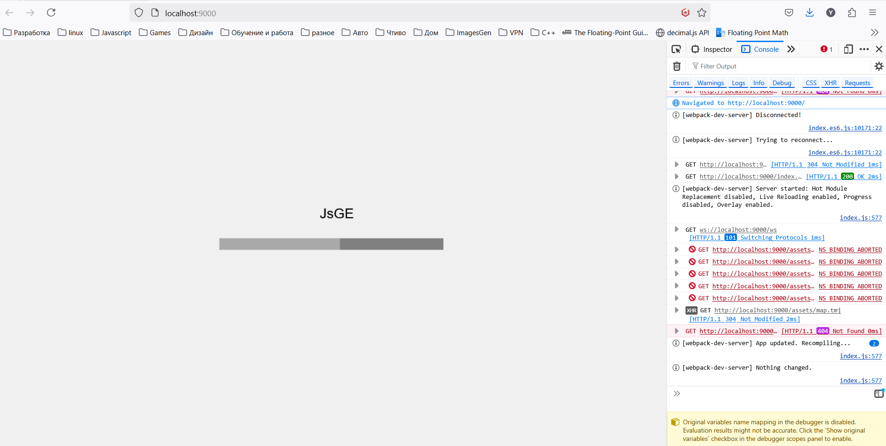
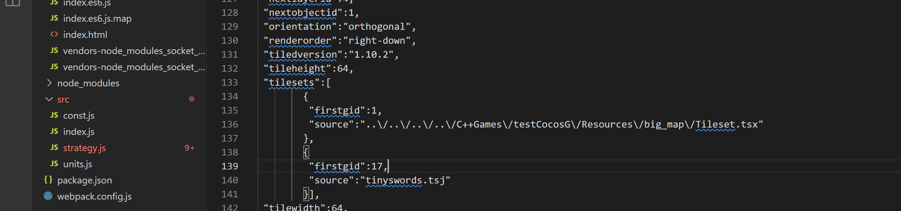

1. jsge stuns on preloading assets stage, some of the assets doesn't loaded correctly  

All assets should be under the server folder.

Tiled Editor, sets absolute paths to the images, if you open the tilemap.tmj, you could see something like that:

This source for Tileset is not correct and should be fixed according the server root.