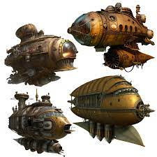

Assume you want to render an image 
## Prepare:
1. **Set up a web server:** jsge is a library for a web application, so you will need a web server.  
   In this tutorial, we will use a Node.js web server. First, install Node.js and npm.
2. **Create a folder** to contain your game files and place an image named "images.jpg" in it.
3. **Create a `package.json` file** to store information about the game and its main dependencies. You can do this from the command line (terminal) with
   ```
   npm init
   ```
4. **Install jsge**:
   ```
   npm i jsge
   ```
6. **Install a webserver**:
   ```
   npm i http-server
   ```
7. **Add a command to run the server in the `package.json`:**
   ```
   "scripts": {
       "start": "http-server -c-1 -p 9000 -o /"
   },
   ```
8. **Start the server** from the command line (terminal):
   ```
   npm start
   ```
9. **Check `http://127.0.0.1:9000`** in the browser, it will show your folder structure.

## App logic:
1. **Create index.html file**:
   ```
   <!DOCTYPE html>
   <head>
       <script type="module" src="./index.js"></script>
   </head>
   <body>
       <div id="game_map"></div>
   </body>
   ```
2. **Create index.js file**, which will store app logic. Inside index.js create a {@link System} instance, passing game options or a {@link SystemSettings} object and game canvas container:
   ```
   import { System, SystemSettings } from "jsge";
   const app = new System(SystemSettings, document.getElementById("game_map"));
   ```
3. **Create you game pages** using classes extended from {@link GameStage}:
   ```
   import { ..., GameStage } from "jsge";

   class CustomPage extends GameStage {
   }
   ```
4. **Add the image** passing image key and path to [CustomPage.iLoader]{@tutorial assets_manager}.addImage() in the [GameStage.register()]{@tutorial stages_lifecycle}:
   ```
   class CustomPage extends GameStage {
       register() {
           this.iLoader.addImage("image_key", "/images.jpg");
       }
   }
   ```
5. **Create an DrawImageObject and add it to the stage**, use image key added on step 4:
   ```
           ...
           this.player = this.draw.image(100, 200, 16, 28, "image_key", 0);
       }
   }
   ```
6. **Register pages in the application:**
   ```
   app.registerStage("CustomPageKey", CustomPage);
   ```
7. **Run [preloadAllData()]{@link System#preloadAllData}** to load all data you added on step 4:
   ```
   app.preloadAllData().then(() => {
   ```
8. **After `preloadAllData()` resolves, start the stage rendering** with app.iSystem.startGameStage(pageKey):
   ```
   app.preloadAllData().then(() => {
       app.iSystem.startGameStage("CustomPageKey");
   });
   ```
9. **Now visit `http://127.0.0.1:9000`** Your image now will be rendered!  
10. **Use `document.addEventListener`** to attach mouse or keyboard controllers and  
move attached object on the screen changing `x`, `y`, or `rotation` properties

## Live example:
<p class="codepen" data-height="500" data-default-tab="js,result" data-slug-hash="mdvgQyv" data-user="yaalfred" style="height: 500px; box-sizing: border-box; display: flex; align-items: center; justify-content: center; border: 2px solid; margin: 1em 0; padding: 1em;">
  <span>See the Pen <a href="https://codepen.io/yaalfred/pen/mdvgQyv">
  JsGE basic example</a> by Arturas-Alfredas Lapinskas (<a href="https://codepen.io/yaalfred">@yaalfred</a>)
  on <a href="https://codepen.io">CodePen</a>.</span>
</p>
<script async src="https://cpwebassets.codepen.io/assets/embed/ei.js"></script>